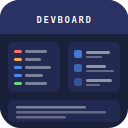

<div align="center">



# DevBoard

**Your developer dashboard, living right in the sidebar.**


Track TODOs · Pin files · Take notes — all without leaving the editor.

</div>

---

## Overview

DevBoard is a zero-config VSCode extension that gives you a personal dashboard in the sidebar. Everything lives in one unified panel that can't be accidentally closed or rearranged — it's always right there when you need it.

No external dependencies. No backend. No setup.

---

## Features

### 📋 TODO Tracker

Never lose a `TODO` in your codebase again. DevBoard scans every source file in your project and groups comment tags by type so you always know what needs attention.

- Detects **`TODO`**, **`FIXME`**, **`BUG`**, **`HACK`**, **`NOTE`**, and **`XXX`**
- Color-coded and grouped by tag — highest priority first
- Click any item to jump straight to that exact line
- Auto-refreshes every time you save a file
- Intelligently skips `node_modules`, `.git`, `dist`, `build`, and other non-source directories

### 📎 Pinned Files

Stop re-opening the same files over and over. Pin the files you're actively working on and they stay in your sidebar — even after closing tabs or restarting VSCode.

- Right-click any file in the Explorer → **DevBoard: Pin File**
- Pins persist across sessions and workspace restarts
- Click any pin to open it instantly
- Hover to reveal the unpin button

### ✏️ Notes

A persistent markdown scratch pad tied to your workspace. Jot down ideas, paste links, record decisions — it's always a glance away.

- Write freely inside the sidebar panel
- Auto-saves 500ms after you stop typing
- **Open in tab ↗** to expand into a full Markdown editor
- Each workspace has its own independent notes
- Saved as a real file at `.vscode/devboard-notes.md`

---

## Installation

**Via Marketplace:**
1. Open VSCode
2. Press `Ctrl+P` (or `Cmd+P` on Mac)
3. Run `ext install melvsanity.devboard`

**Via VSIX:**
1. Download the latest `.vsix` from [Releases](https://github.com/yourusername/devboard/releases)
2. Open VSCode → Extensions → `···` menu → **Install from VSIX**

---

## Usage

Click the **DevBoard icon** in the Activity Bar to open the panel. All three sections are collapsible — click any section header to expand or collapse it.

### Pinning a file
1. Right-click any file in the Explorer
2. Select **DevBoard: Pin File**
3. It appears instantly in the Pinned Files section

### Refreshing TODOs
Click **↻** in the TODO Tracker header, or just save any file — DevBoard refreshes automatically.

### Opening notes in a full tab
Click **Open in tab ↗** inside the Notes section to open your notes as a full Markdown editor.

---

## Supported Languages

DevBoard scans TODO comments across all major file types:

| Category | Extensions |
|---|---|
| JavaScript / TypeScript | `js` `ts` `jsx` `tsx` |
| Systems | `c` `cpp` `cs` `rs` `go` `swift` `kt` |
| Backend | `py` `java` `rb` `php` |
| Web | `vue` `html` `css` `scss` |
| Config & Docs | `sh` `yaml` `yml` `md` |

---

## Gitignore

To keep your project notes out of git, add this to your `.gitignore`:

```gitignore
.vscode/devboard-notes.md
```

---

## Requirements

- VSCode `1.75.0` or higher
- No other dependencies

---

## Release Notes

### 2.0.0 — Unified Panel
- Rebuilt as a single unified webview panel — sections can no longer be accidentally hidden or rearranged
- Collapsible sections with smooth chevron indicators
- Improved notes toolbar with character count and save confirmation
- Tag groups are now individually collapsible inside the TODO Tracker

### 1.0.0 — Initial Release
- TODO Tracker with tag grouping
- Pinned Files with persistent storage
- Project Notepad with auto-save

---

## Contributing

Contributions are welcome! If you find a bug or have a feature idea:

1. [Open an issue](https://github.com/yourusername/devboard/issues) to discuss it
2. Fork the repo and create a branch
3. Submit a pull request

---

## License

MIT © [melvsanity](https://github.com/yourusername)
