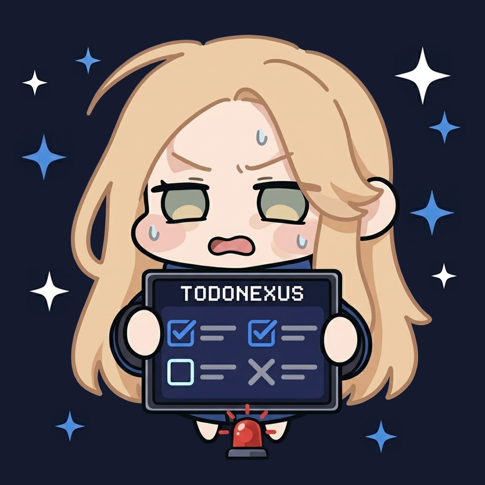

<div align="center">



# TodoNexus

**Your developer nexus for TODOs, notes, and workspace focus — all in the sidebar.**


[](LICENSE)

Track TODOs · Take notes · Stay focused — without leaving your editor.

</div>

---

## Overview

TodoNexus is a zero-config VSCode extension that brings your development workflow into one unified sidebar hub. It automatically scans your entire workspace and **detects and tracks every important code comment**, including:

**`TODO` · `FIXME` · `BUG` · `HACK` · `NOTE` · `XXX`**

This means you never lose track of work again — tasks are surfaced instantly, grouped automatically, and always visible inside your sidebar. Auto-refreshes every time you save a file.

No setup. No backend. No distractions.

---

## Features

### 📋 TODO Tracker

Never lose a TODO again. TodoNexus scans your entire workspace and organizes comment tags into a clean, navigable view.

- Detects **`TODO`**, **`FIXME`**, **`BUG`**, **`HACK`**, **`NOTE`**, and **`XXX`**
- Grouped by tag with color indicators
- Click to jump directly to the exact line in code
- Auto-refreshes on every file save
- Ignores `node_modules`, `dist`, `build`, `.git`, and other noise folders

---

### ✏️ Notes

A persistent workspace-aware markdown note system for ideas, reminders, and reference material.

- Click **+** to create as many named notes as you need
- Click any note to open it as a full editor tab
- Delete notes directly from the sidebar
- Each note saved as `.vscode/todonexus-[name].md` — one file per note, easy to commit or ignore
- Notes are per workspace so different projects stay separate

---

### 🧠 Quick Scratch Pad

A lightweight always-available text area for temporary thoughts.

- Instant auto-save as you type
- Character counter
- Perfect for quick snippets, links, or debugging notes

---

## Installation

**Via Marketplace:**

1. Open VSCode
2. Press `Ctrl+P` (or `Cmd+P` on Mac)
3. Run:
   ```
   ext install melvsanity.todonexus
   ```

**Via VSIX:**

1. Download the latest `.vsix` from [Releases](https://github.com/Melvsanity/TodoNexus-extension/releases)
2. Open VSCode → Extensions → `···` → **Install from VSIX**

---

## Usage

Click the **TodoNexus icon** in the Activity Bar to open the sidebar panel.

### Using TODO Tracker
- Save any file → TODOs update automatically
- Click any item → jump to that exact line in code

### Creating Notes
- Click **+** in the Notes section header
- Enter a name → the note opens as a full editor tab
- Click any note in the list to reopen it
- Hover a note and click **✕** to delete it

### Scratch Pad
- Just type — it saves automatically
- Use it for temporary thoughts, links, or debugging notes

---

## Supported Languages

TodoNexus scans TODO comments across all major languages:

| Category | Extensions |
|---|---|
| JavaScript / TypeScript | `js` `ts` `jsx` `tsx` |
| Systems | `c` `cpp` `cs` `rs` `go` `swift` `kt` |
| Backend | `py` `java` `rb` `php` |
| Web | `vue` `html` `css` `scss` |
| Config & Docs | `sh` `yaml` `yml` `md` |

---

## Gitignore

To avoid tracking workspace notes in git:

```gitignore
.vscode/todonexus-*.md
```

---

## Requirements

- VSCode `1.75.0` or higher
- No dependencies

---

## Contributing

Contributions are welcome:

1. [Open an issue](https://github.com/Melvsanity/TodoNexus-extension/issues)
2. Fork the repo
3. Create a feature branch
4. Submit a pull request

---

## License

MIT © [melvsanity](https://github.com/Melvsanity)